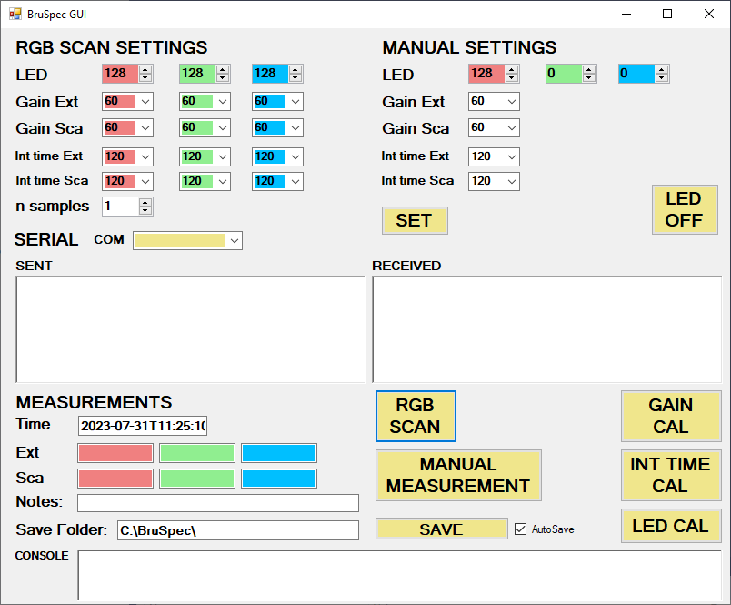

# BruSpec_GUI
A GUI control toolkit for the BruSpec DIY Arduino spectrophotometer. Built in C++/CLI using Windows forms in Visual Studio.

Most of the work is done in Form1.h

Data are stored in classes in MeasClass.h and SettingsClass.h

File saving is handled by CSVSaver.h

Serial comms is handled by SerialManager.h and SerialManager.cpp

Note from the author: If I started again I probably wouldn't use C++/CLI or Visual Studio. It's good for moving the buttons around easily but I've found it very difficult to keep the backend tidy
